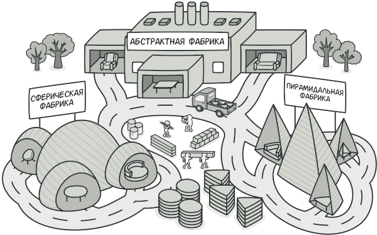

# Абстрактная фабрика (Abstract Factory)

Абстрактная фабрика — это порождающий паттерн проектирования, который позволяет создавать семейства связанных объектов, не привязываясь к конкретным классам создаваемых объектов.

## Преимущества
🟢 Гарантирует сочетаемость создаваемых продуктов. 

🟢 Избавляет клиентский код от привязки к конкретным классам продуктов. 

🟢 Выделяет код производства продуктов в одно место, упрощая поддержку кода. 

🟢 Упрощает добавление новых продуктов в программу. 

🟢 Реализует принцип открытости/закрытости.

# Недостатки
🔴 Усложняет код программы из-за введения множества дополнительных классов. 
 
🔴 Требует наличия всех типов продуктов в каждой вариации.