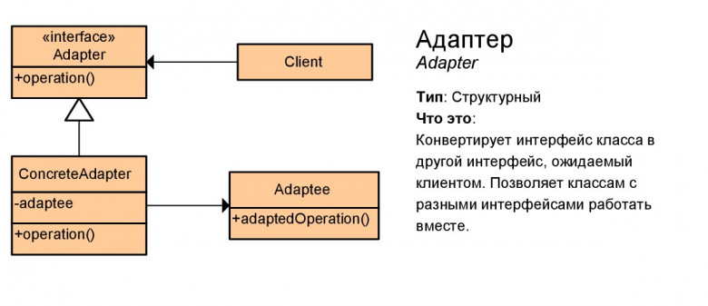

# Адаптер (Adapter)

Адаптер — это структурный паттерн проектирования, который позволяет объектам с несовместимыми интерфейсами работать вместе.

## Преимущества
🟢 Отделяет и скрывает от клиента подробности преобразования различных интерфейсов.

# Недостатки
🔴 Усложняет код программы из-за введения дополнительных классов.

