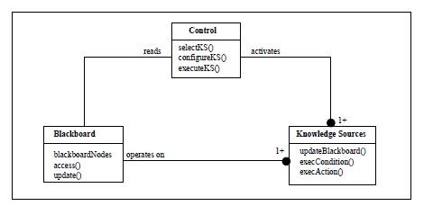

# Классная доска или доска объявлений (Blackboard)

**Классная доска** —  это поведенческий шаблон проектирования, который обеспечивает вычислительную основу для проектирования и реализации систем, которые объединяют большие и разнообразные специализированные модули и реализуют сложные недетерминированные стратегии управления.

