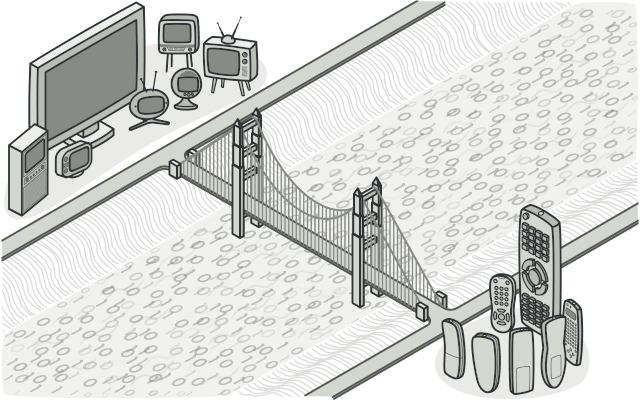
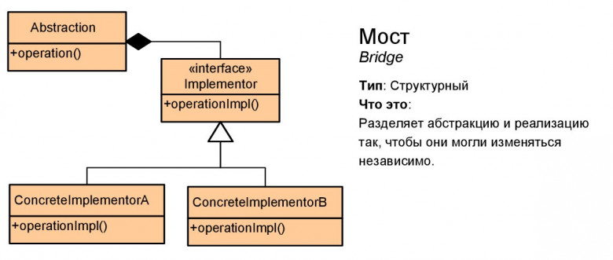

# Мост (Bridge)

Мост — это структурный паттерн проектирования, который разделяет один или несколько классов на две отдельные иерархии — абстракцию и реализацию, позволяя изменять их независимо друг от друга.

## Преимущества
🟢 Позволяет строить платформо-независимые программы.

🟢 Скрывает лишние или опасные детали реализации от клиентского кода.

🟢 Реализует принцип открытости/закрытости.

# Недостатки
🔴 Усложняет код программы из-за введения дополнительных классов.

