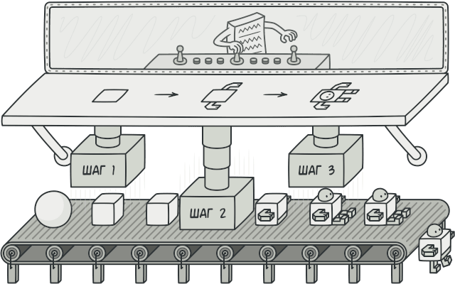
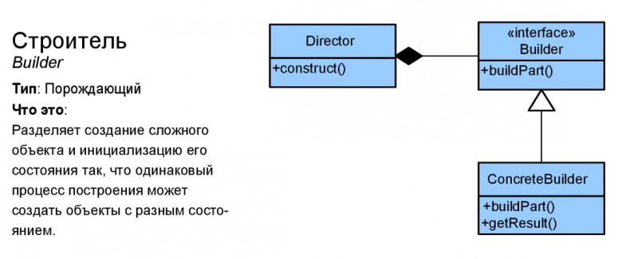

# Строитель (Builder)

**Строитель** — это порождающий паттерн проектирования, который позволяет создавать сложные объекты пошагово. Строитель даёт возможность использовать один и тот же код строительства для получения разных представлений объектов.

## Преимущества
🟢 Позволяет создавать продукты пошагово.

🟢 Позволяет использовать один и тот же код для создания различных продуктов.

🟢 Изолирует сложный код сборки продукта от его основной бизнес-логики.

# Недостатки
🔴  Усложняет код программы из-за введения дополнительных классов.
 
🔴 Клиент будет привязан к конкретным классам строителей, так как в интерфейсе директора может не быть метода получения результата.

