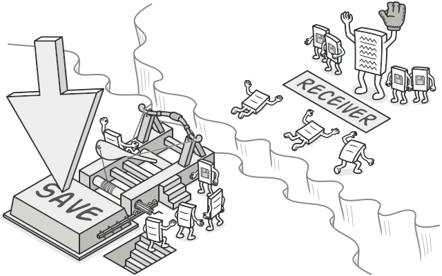
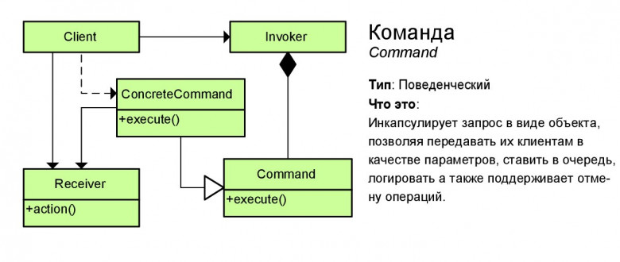

# Команда (Command)

**Команда** — это поведенческий паттерн проектирования, который превращает запросы в объекты, позволяя передавать их как аргументы при вызове методов, ставить запросы в очередь, логировать их, а также поддерживать отмену операций.

## Преимущества
🟢 Убирает прямую зависимость между объектами, вызывающими операции, и объектами, которые их непосредственно выполняют.

🟢 Позволяет реализовать простую отмену и повтор операций.

🟢 Позволяет реализовать отложенный запуск операций.

🟢 Позволяет собирать сложные команды из простых.

🟢 Реализует принцип открытости/закрытости.

# Недостатки
🔴 Усложняет код программы из-за введения множества дополнительных классов.

