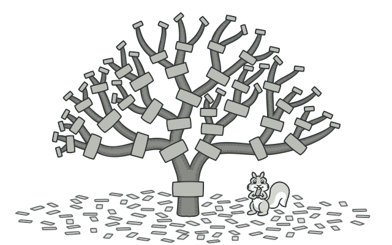
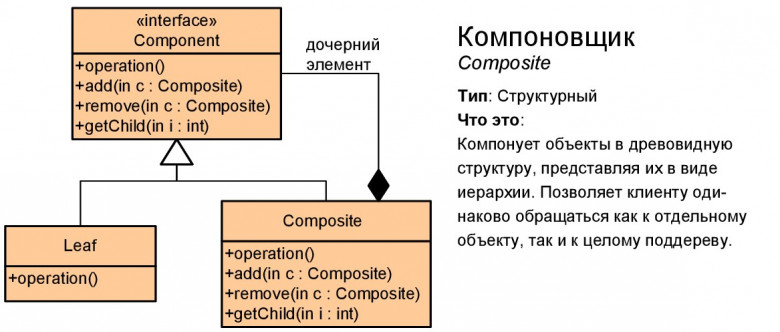

# Компоновщик (Composite)

**Компоновщик** — это структурный паттерн проектирования, который позволяет сгруппировать множество объектов в древовидную структуру, а затем работать с ней так, как будто это единичный объект.

## Преимущества
🟢 Упрощает архитектуру клиента при работе со сложным деревом компонентов.

🟢 Облегчает добавление новых видов компонентов.

# Недостатки
🔴 Создаёт слишком общий дизайн классов.

