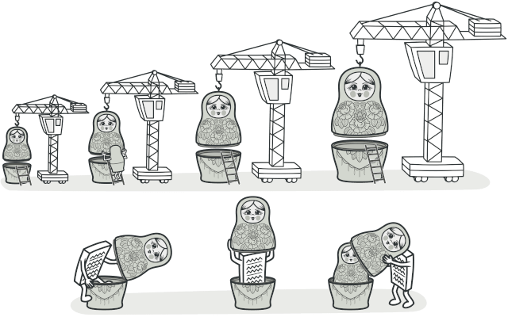
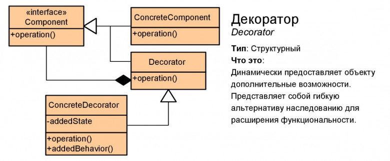

# Декоратор (Decorator)

Декоратор — это структурный паттерн проектирования, который позволяет динамически добавлять объектам новую функциональность, оборачивая их в полезные «обёртки».

## Преимущества
🟢 Большая гибкость, чем у наследования.

🟢 Позволяет добавлять обязанности на лету.

🟢 Можно добавлять несколько новых обязанностей сразу.

🟢 Позволяет иметь несколько мелких объектов вместо одного объекта на все случаи жизни.

# Недостатки
🔴 Трудно конфигурировать многократно обёрнутые объекты. 

🔴 Обилие крошечных классов.

