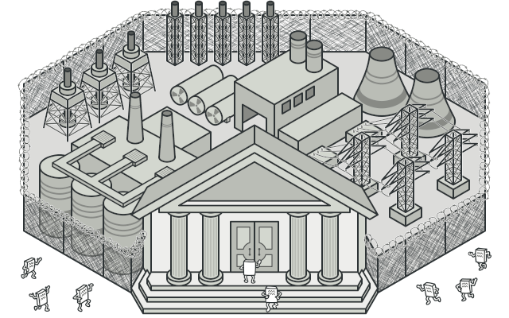
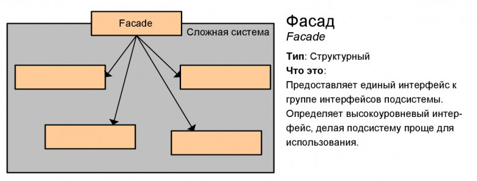

# Фасад (Facade)

**Фасад** — это структурный паттерн проектирования, который предоставляет простой интерфейс к сложной системе классов, библиотеке или фреймворку.

## Преимущества
🟢 Изолирует клиентов от компонентов сложной подсистемы.

# Недостатки
🔴 Фасад рискует стать [божественным объектом](https://ru.wikipedia.org/wiki/%D0%91%D0%BE%D0%B6%D0%B5%D1%81%D1%82%D0%B2%D0%B5%D0%BD%D0%BD%D1%8B%D0%B9_%D0%BE%D0%B1%D1%8A%D0%B5%D0%BA%D1%82), привязанным ко всем классам программы.

