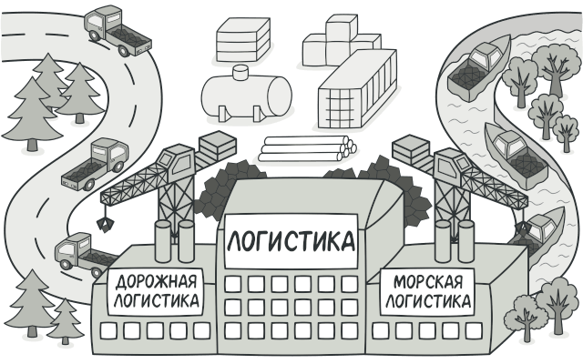
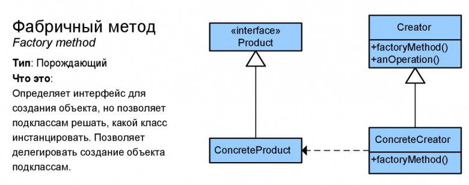

# Фабричный метод (Factory Method)

**Фабричный метод** — это порождающий паттерн проектирования, который определяет общий интерфейс для создания объектов в суперклассе, позволяя подклассам изменять тип создаваемых объектов.

## Преимущества
🟢 Избавляет класс от привязки к конкретным классам продуктов.

🟢 Выделяет код производства продуктов в одно место, упрощая поддержку кода.

🟢 Упрощает добавление новых продуктов в программу.

🟢 Реализует принцип открытости/закрытости.

# Недостатки
🔴 Может привести к созданию больших параллельных иерархий классов, так как для каждого класса продукта надо создать свой подкласс создателя.

