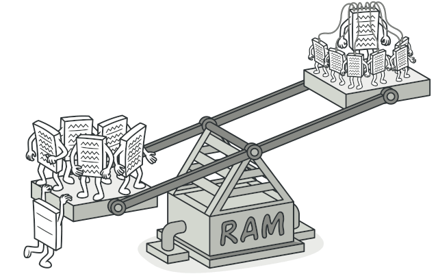
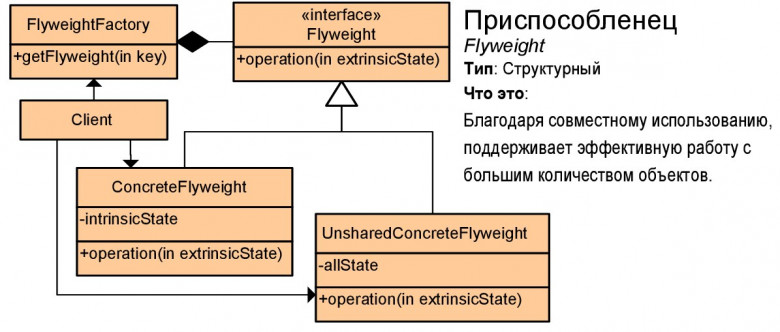

# Легковес или Приспособленец (Flyweight)

**Легковес** — это структурный паттерн проектирования, который позволяет вместить бóльшее количество объектов в отведённую оперативную память. Легковес экономит память, разделяя общее состояние объектов между собой, вместо хранения одинаковых данных в каждом объекте.

## Преимущества
🟢 Экономит оперативную память.

# Недостатки
🔴 Расходует процессорное время на поиск/вычисление контекста.

🔴 Усложняет код программы из-за введения множества дополнительных классов.

