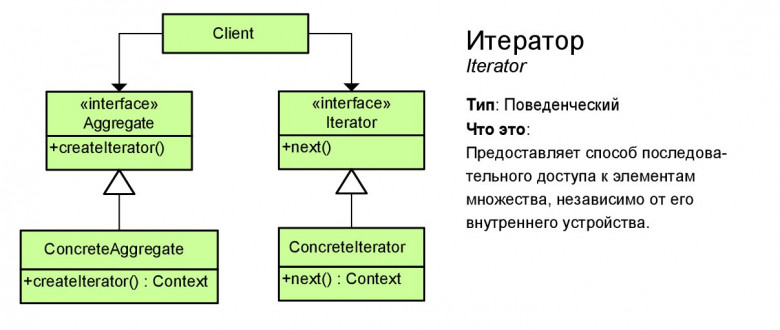

# Итератор (Iterator)

**Итератор** — это поведенческий паттерн проектирования, который даёт возможность последовательно обходить элементы составных объектов, не раскрывая их внутреннего представления.

## Преимущества
🟢 Упрощает классы хранения данных.

🟢 Позволяет реализовать различные способы обхода структуры данных.

🟢 Позволяет одновременно перемещаться по структуре данных в разные стороны.

# Недостатки
🔴 Не оправдан, если можно обойтись простым циклом.

