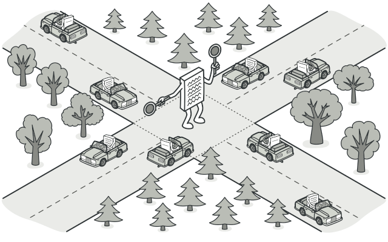
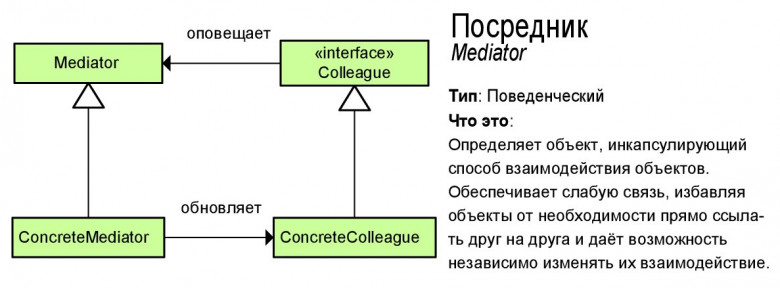

# Посредник (Mediator)

**Посредник** — это поведенческий паттерн проектирования, который позволяет уменьшить связанность множества классов между собой, благодаря перемещению этих связей в один класс-посредник.

## Преимущества
🟢 Устраняет зависимости между компонентами, позволяя повторно их использовать.

🟢 Упрощает взаимодействие между компонентами.

🟢 Централизует управление в одном месте.

# Недостатки
🔴 Посредник может сильно раздуться.

