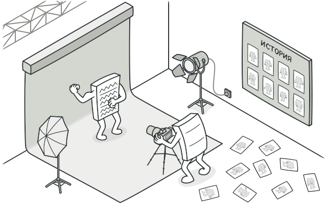
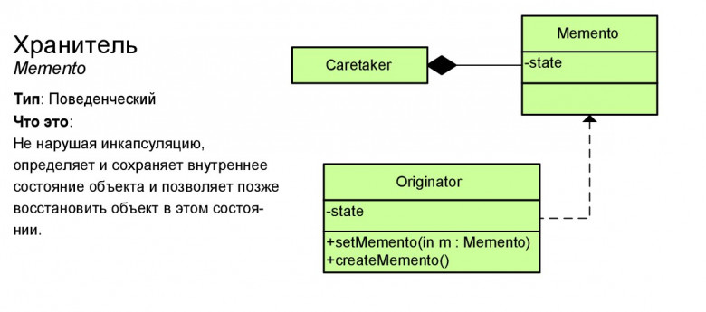

# Снимок или Хранитель (Memento)

**Снимок** — это поведенческий паттерн проектирования, который позволяет сохранять и восстанавливать прошлые состояния объектов, не раскрывая подробностей их реализации.

## Преимущества
🟢 Не нарушает инкапсуляции исходного объекта.

🟢 Упрощает структуру исходного объекта. Ему не нужно хранить историю версий своего состояния.

# Недостатки
🔴 Требует много памяти, если клиенты слишком часто создают снимки.

🔴 Может повлечь дополнительные издержки памяти, если объекты, хранящие историю, не освобождают ресурсы, занятые устаревшими снимками.

🔴 В некоторых языках (например, PHP, Python, JavaScript) сложно гарантировать, чтобы только исходный объект имел доступ к состоянию снимка.

