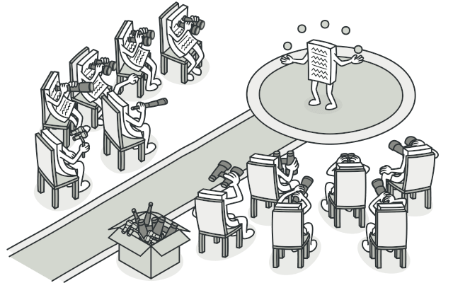
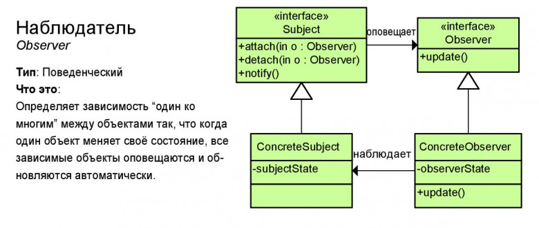

# Наблюдатель (Observer)

**Наблюдатель** — это поведенческий паттерн проектирования, который создаёт механизм подписки, позволяющий одним объектам следить и реагировать на события, происходящие в других объектах.

## Преимущества
🟢 Издатели не зависят от конкретных классов подписчиков и наоборот.

🟢 Вы можете подписывать и отписывать получателей на лету.

🟢 Реализует принцип открытости/закрытости.

# Недостатки
🔴 Подписчики оповещаются в случайном порядке.

