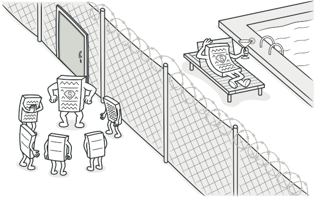
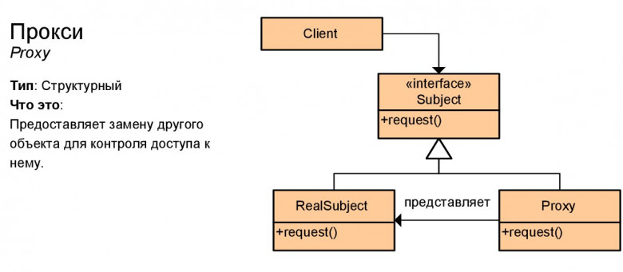

# Заместитель (Proxy)

**Заместитель** — это структурный паттерн проектирования, который позволяет подставлять вместо реальных объектов специальные объекты-заменители. Эти объекты перехватывают вызовы к оригинальному объекту, позволяя сделать что-то до или после передачи вызова оригиналу.

## Преимущества
🟢 Позволяет контролировать сервисный объект незаметно для клиента.

🟢 Может работать, даже если сервисный объект ещё не создан.

🟢 Может контролировать жизненный цикл служебного объекта.

# Недостатки
🔴 Усложняет код программы из-за введения дополнительных классов.

🔴 Увеличивает время отклика от сервиса.

