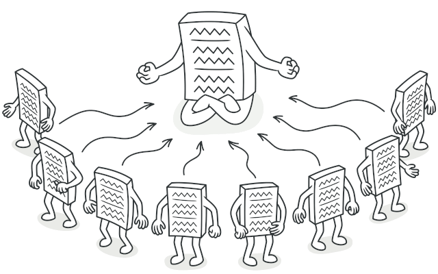
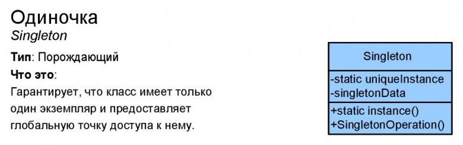

# Одиночка (Singleton)

**Одиночка** — это порождающий паттерн проектирования, который гарантирует, что у класса есть только один экземпляр, и предоставляет к нему глобальную точку доступа.

## Преимущества
🟢 Гарантирует наличие единственного экземпляра класса.

🟢 Предоставляет к нему глобальную точку доступа.

🟢 Реализует отложенную инициализацию объекта-одиночки.

# Недостатки
🔴 Нарушает принцип единственной ответственности класса.

🔴 Маскирует плохой дизайн.

🔴 Проблемы мультипоточности.

🔴 Требует постоянного создания Mock-объектов при юнит-тестировании.

