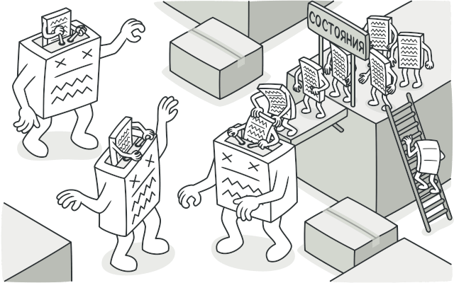
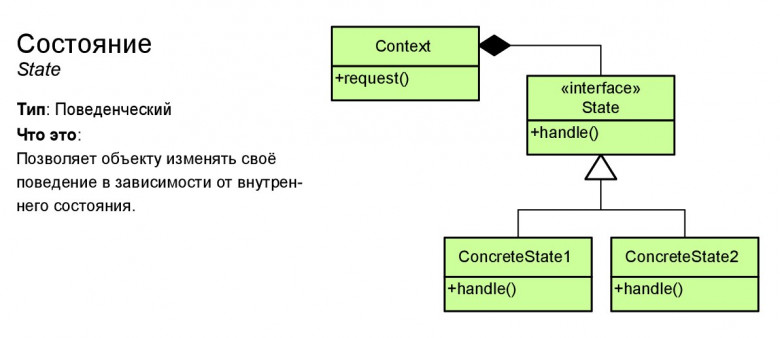

# Состояние (State)

**Состояние** — это поведенческий паттерн проектирования, который позволяет объектам менять поведение в зависимости от своего состояния. Извне создаётся впечатление, что изменился класс объекта.

## Преимущества
🟢 Избавляет от множества больших условных операторов машины состояний.

🟢 Концентрирует в одном месте код, связанный с определённым состоянием.

🟢 Упрощает код контекста.

# Недостатки
🔴 Может неоправданно усложнить код, если состояний мало и они редко меняются.

