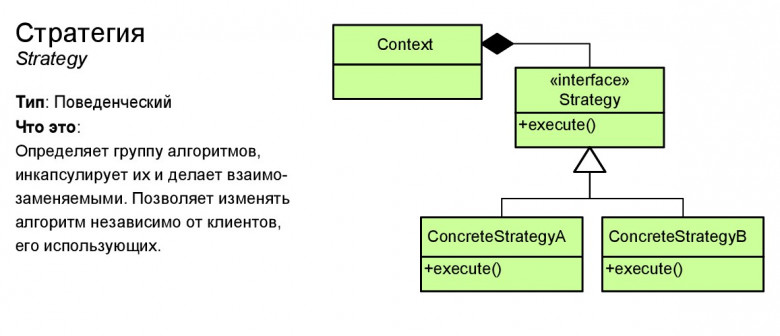

# Стратегия (Strategy)

**Стратегия** — это поведенческий паттерн проектирования, который определяет семейство схожих алгоритмов и помещает каждый из них в собственный класс, после чего алгоритмы можно взаимозаменять прямо во время исполнения программы.

## Преимущества
🟢 Горячая замена алгоритмов на лету.

🟢 Изолирует код и данные алгоритмов от остальных классов.

🟢 Уход от наследования к делегированию.

🟢 Реализует принцип открытости/закрытости.

# Недостатки
🔴 Усложняет программу за счёт дополнительных классов.

🔴 Клиент должен знать, в чём состоит разница между стратегиями, чтобы выбрать подходящую.

