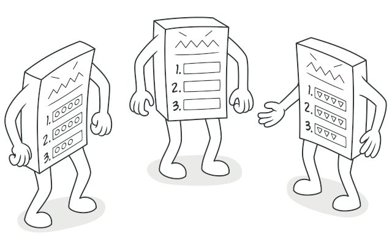
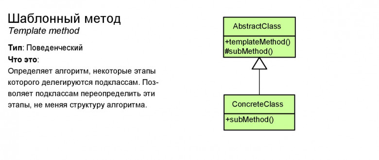

# Шаблонный метод (Template Method)

**Шаблонный метод** — это поведенческий паттерн проектирования, который определяет скелет алгоритма, перекладывая ответственность за некоторые его шаги на подклассы. Паттерн позволяет подклассам переопределять шаги алгоритма, не меняя его общей структуры.

## Преимущества
🟢 Облегчает повторное использование кода.

# Недостатки
🔴 Вы жёстко ограничены скелетом существующего алгоритма.

🔴 Вы можете нарушить принцип подстановки Барбары Лисков, изменяя базовое поведение одного из шагов алгоритма через подкласс.

🔴 С ростом количества шагов шаблонный метод становится слишком сложно поддерживать.

