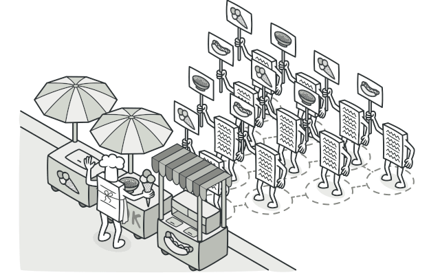
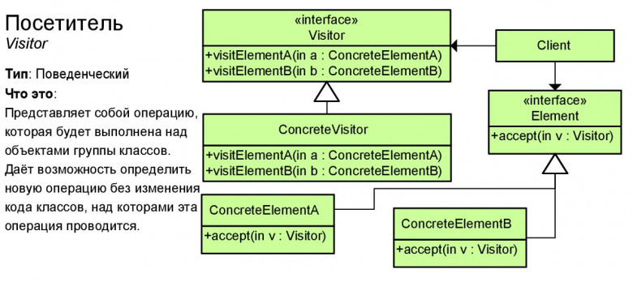

# Посетитель (Visitor)

**Посетитель** — это поведенческий паттерн проектирования, который позволяет добавлять в программу новые операции, не изменяя классы объектов, над которыми эти операции могут выполняться.

## Преимущества
🟢 Упрощает добавление операций, работающих со сложными структурами объектов.

🟢 Объединяет родственные операции в одном классе.

🟢 Посетитель может накапливать состояние при обходе структуры элементов.

# Недостатки
🔴 Паттерн не оправдан, если иерархия элементов часто меняется.

🔴 Может привести к нарушению инкапсуляции элементов.

